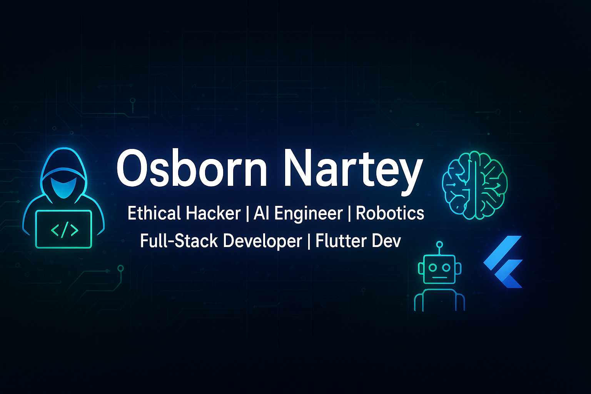

  

<h2 align="center">Hi 👋! My name is <b>Osborn Nartey</b> and I'm an <b>Ethical Hacker</b>, <b>Embedded Systems & AI Engineer</b>, and <b>Full-Stack Developer</b> from Ghana 🌍</h2>

---

  
  

---

### 🏷️ My Tech Identity  

  
  
  
  
  

---

### 💻 Tech Stack  

  
  
  
  
  
  
  

---

### 🚀 About Me  
- 🔐 **Ethical Hacker** specializing in Pentesting, Reverse Engineering, OSINT & Exploit Development  
- 🤖 **Robotics & Embedded Systems** (Arduino, Raspberry Pi, IoT solutions)  
- 🧠 **AI Engineer** with expertise in TensorFlow, PyTorch & intelligent system design  
- 📱 **Flutter Developer** crafting high-performance cross-platform apps  
- 🌐 **Full-Stack Developer** (MERN & Node.js backends)  
- 💡 Passionate about building **secure, intelligent & impactful technology**  

---

### 🏆 CTF & Cybersecurity Experience  
- Active on **HackTheBox**, **TryHackMe**, **MetaCTF**, **VishwaCTF**, **PhoenoexCTF**  
- Skilled in:  
  - Network, System & Web Application Pentesting  
  - Binary Exploitation & Reverse Engineering  
  - OSINT & Social Engineering  
- Developed **custom encryption scripts & security tools**  

---

### 🔨 Featured Projects  
- 🏠 **[HomeBoss](#)** → Smart home system for lighting, doors & security (IoT + mobile app)  
- 🙏 **[Faith Haven](#)** → Devotional web platform with admin dashboard (Node.js + MongoDB)  
- 🛡 **[Lock3t](#)** → Secure social media with built-in crypto transactions  
- 🤖 **[HEBINAR](#)** → Human Emotion Based Intelligence Robot (emotion-simulating assistant)  
- 🚀 **[Smartii Dashboard](#)** → Futuristic smart home interface with voice control  

---

### 📌 Quick Facts  
- 🌍 Based in **Ghana**  
- 📚 Self-taught + pursuing a **university degree in tech**  
- 💼 Open to **remote & on-site opportunities**  
- 🤝 Looking to collaborate on **AI, security, IoT, and impactful open-source projects**  

---

### 📫 Connect with Me  

  
  

---

